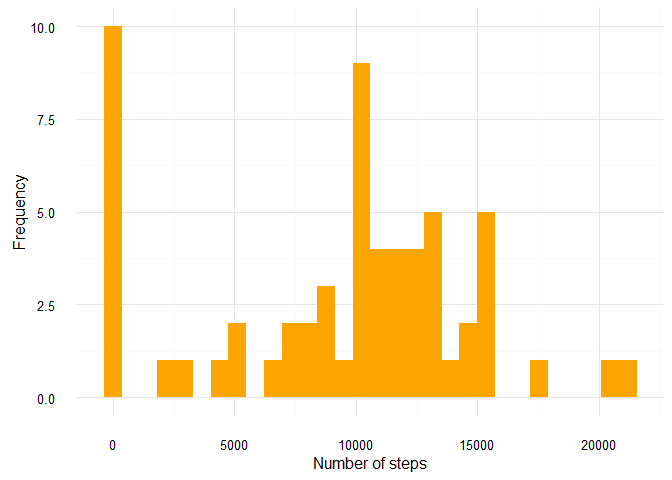
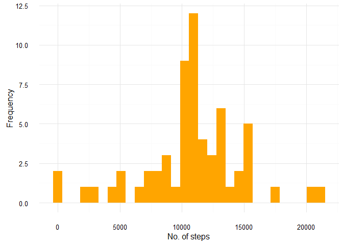
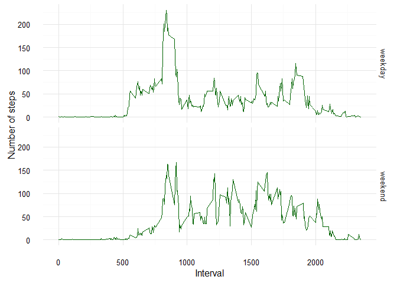

# Reproducible Research: Peer Assessment 1


## Loading and preprocessing the data

```r
#required packages 
library(dplyr)
library(ggplot2)
library(scales)

#to extract the dataset
f <- "activity.zip"
if (!file.exists("activity.csv")) { 
  unzip(f) 
}
rm(f)

#to read the dataset
act<-read.csv("activity.csv")
act$date<-as.Date(act$date,"%Y-%m-%d")

#summary of data to get a overview
summary(act)
```

```
##      steps             date               interval     
##  Min.   :  0.00   Min.   :2012-10-01   Min.   :   0.0  
##  1st Qu.:  0.00   1st Qu.:2012-10-16   1st Qu.: 588.8  
##  Median :  0.00   Median :2012-10-31   Median :1177.5  
##  Mean   : 37.38   Mean   :2012-10-31   Mean   :1177.5  
##  3rd Qu.: 12.00   3rd Qu.:2012-11-15   3rd Qu.:1766.2  
##  Max.   :806.00   Max.   :2012-11-30   Max.   :2355.0  
##  NA's   :2304
```

<p>
Made the date column of the dataset of class "Date" in order to process it efficiently.
</p>

## What is mean total number of steps taken per day?

```r
#to calculate the total steps taken grouped by date
total_perday<-act%>%group_by(date)%>%summarise(steps_taken=sum(as.double(unlist(steps)),na.rm=TRUE))
head(total_perday[,1:2])
```

```
## Source: local data frame [6 x 2]
## 
##         date steps_taken
##       <date>       <dbl>
## 1 2012-10-01           0
## 2 2012-10-02         126
## 3 2012-10-03       11352
## 4 2012-10-04       12116
## 5 2012-10-05       13294
## 6 2012-10-06       15420
```

<p>
Here, shown output is the dataset containing the total steps per day.
</p>


```r
#plot 1
ggplot(total_perday,aes(x=steps_taken,fill="x"))+geom_histogram(show.legend = FALSE)+theme_minimal()+labs(x="Number of steps",y="Frequency")+scale_fill_manual(values = "orange")
```

<!-- -->


```r
#to calculate the mean and median of the total steps taken per day
x<-c(mean(total_perday$steps_taken),median(total_perday$steps_taken))
names(x)<-c("mean","median")
x
```

```
##     mean   median 
##  9354.23 10395.00
```

<p>

We can see that the <b>mean</b> of the dataset and <b>median</b> of the dataset vary in about 1000 and since the median is higher than the mean we can say that the data is somewhat right skewed.

</p>

## What is the average daily activity pattern?


```r
#to calculate the average steps grouped by interval
avg_steps<-act%>%group_by(interval)%>%summarise(average=mean(steps,na.rm=TRUE))
avg_steps<-as.data.frame(avg_steps)

#plot 2
with(avg_steps,plot(interval,average,type = "l",col="dark green",xlab = "Interval",ylab="Average no of steps taken",main="Time series plot of daily activity pattern"))
```

<!-- -->

<p>

In this plot we can observe positive-negative trends and the peak value is around 800.


</p>


```r
#to find the interval of the maximum average steps
avg_steps[which.max(avg_steps$average),]
```

```
##     interval  average
## 104      835 206.1698
```


<p>
Interval <b>835</b> is observed to contain the maximum number of average steps, taken accross all dates.

</p>


## Imputing missing values


```r
#to see the demographics of missing data
table(is.na(act$steps))
```

```
## 
## FALSE  TRUE 
## 15264  2304
```


<p>
2304 number of rows contains missing data in steps column before imputation.
</p>


```r
#function replace each missing value with the mean value of its 5-minute interval
fill <- function(steps, interval) {
    value <- NA
    if (!is.na(steps)) 
        value <- c(steps) 
    else 
          value <- (avg_steps[avg_steps$interval == interval, "average"])
    return(value)
}

#to copy original dataset into object imputed
imputed<-act

#to fill the missing values
imputed$steps <- mapply(fill, imputed$steps, imputed$interval)
imputed<-as.data.frame(imputed)

#to calculate total steps per day in imputed dataset
total_perday2<-imputed%>%group_by(date)%>%summarise(steps_taken=sum(as.double(unlist(steps)),na.rm=TRUE))

#plot 3
ggplot(total_perday2,aes(x=steps_taken,fill="x"))+geom_histogram(show.legend = FALSE)+theme_minimal()+labs(x="No. of steps",y="Frequency")+scale_fill_manual(values = "orange")
```

<!-- -->


```r
#to calculate missing demographics after imputation
table(is.na(imputed$steps))
```

```
## 
## FALSE 
## 17568
```


<p>
After imputation no NA values are left.
</p>


```r
#to calculate the mean and median of the imputed data
x<-c(mean(total_perday2$steps_taken),median(total_perday2$steps_taken))
names(x)<-c("mean","median")
x
```

```
##     mean   median 
## 10766.19 10766.19
```


<p>
Both mean and median values are higher after imputing missing data. The reason is that in the original data, there are some days with steps values NA for any interval. The total number of steps taken in such days are set to 0s by default. However, after replacing missing steps values with the mean steps of associated interval value, these 0 values are removed so the average becomes high. Also,strangely mean becomes equal to median.

</p>


## Are there differences in activity patterns between weekdays and weekends?


```r
#function to return factor variable with levels "weekday" and "weekend"
getweekday <- function(date) {
    value <- weekdays(date)
      
   for (i in 1:length(date)) {
     
     if (value[i]=="Sunday" || value[i]=="Saturday")
        value[i] <- "weekend" 
    else 
          value[i] <- "weekday"
     
   } 
  value<-as.factor(value)
  return(value)
}

#to add the new factor variable
imputed<-as.data.frame(imputed%>%mutate(day=getweekday(date)))

head(imputed)
```

```
##       steps       date interval     day
## 1 1.7169811 2012-10-01        0 weekday
## 2 0.3396226 2012-10-01        5 weekday
## 3 0.1320755 2012-10-01       10 weekday
## 4 0.1509434 2012-10-01       15 weekday
## 5 0.0754717 2012-10-01       20 weekday
## 6 2.0943396 2012-10-01       25 weekday
```


<p>
We can observe that the imputed dataset now contains a new coloumn "day" ,the factor variable with two levels indicating whether the day is "weekend" or "weekday".

</p>


```r
##to calculate the average steps grouped by interval
avg_steps<-imputed%>%group_by(day,interval)%>%summarise(average=mean(steps,na.rm=TRUE))
avg_steps<-as.data.frame(avg_steps)

#plot 4
ggplot(avg_steps, aes(interval, average,color="x")) + geom_line(show.legend = FALSE) + facet_grid(day~. ) + 
    xlab("Interval") + ylab("Number of steps")+theme_minimal()+scale_color_manual(values = "dark green")
```

<!-- -->


<p>
Both the trends for weekdays and weekends show simmilar peaks around same interval but on average more steps are recorded during weekends for higher intervals while the highest maximum average is recorded during weekdays.
During the weekdays, morning activities start earlier than the weekends, and there is a clear peak in the mornings, but less activity in the afternoons.
In weekends, morning activities are much less than weekdays, but there are more steady activities last for a whole day.

</p>
